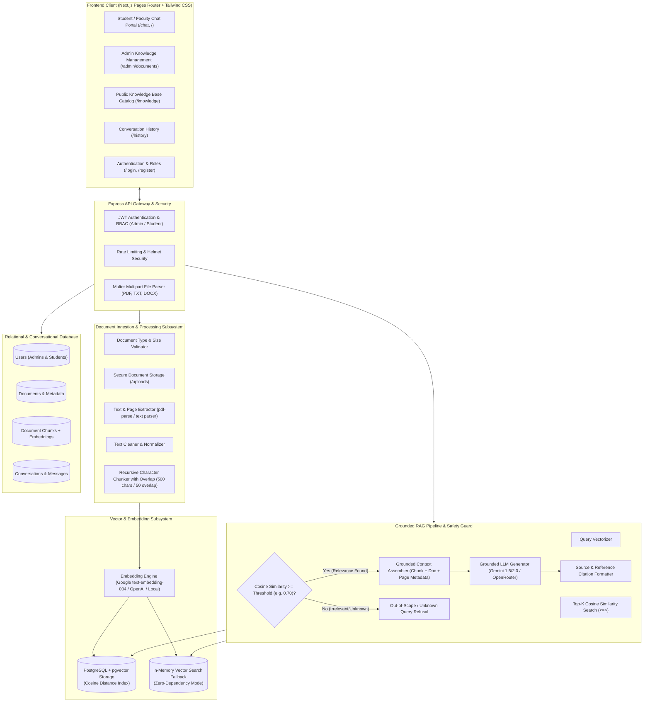
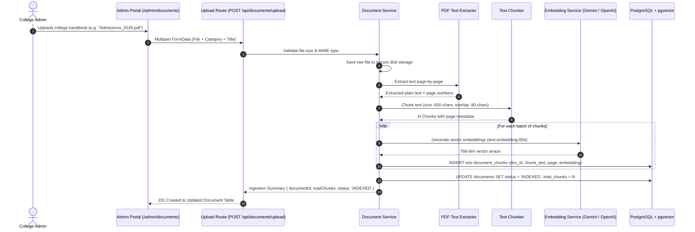
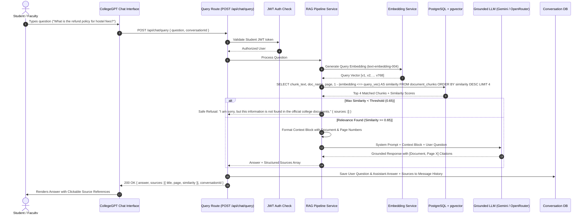
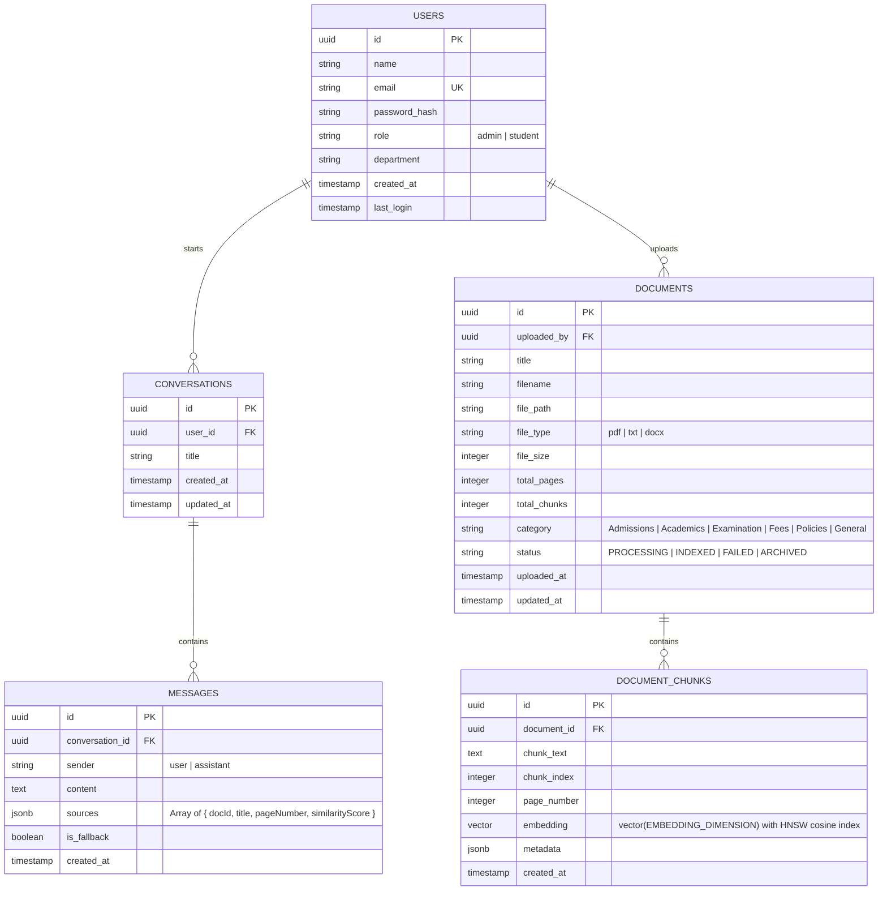

# ARCHITECTURE.md: CollegeGPT — RAG-Based College Information Assistant

## 1. System Identity & Mission

**CollegeGPT** is a dedicated, secure, and grounded Retrieval-Augmented Generation (RAG) platform tailored for higher education institutions. It empowers students, faculty, and administrative staff to query official academic syllabi, campus regulations, admission guidelines, course prerequisites, fee structures, and departmental policies in natural language, receiving precise answers backed by **exact document and page-level source citations**, while preventing hallucinations through strict relevance thresholding.



---

## 2. Comprehensive Subsystem Architectures

### 2.1. Frontend Architecture
- **Framework:** Next.js (Pages Router), React 18, Tailwind CSS, Lucide React icons, Axios, and Zustand.
- **Pages & Routes:**
  - `/` or `/chat`: Main interactive student conversational portal with chat stream, instant prompt suggestions, markdown formatting, and clickable source reference chips.
  - `/admin/documents`: Administrator panel for uploading PDF handbooks/syllabi, monitoring extraction progress, viewing chunk breakdowns, toggling document active status, and deleting documents.
  - `/knowledge`: Public searchable catalogue of indexed college handbooks, fee circulars, and departmental guidelines.
  - `/history`: Historical log of previous student question-answer threads.
  - `/login` & `/register`: Clean, dark-themed authentication with Student/Admin role selection.
  - `/settings`: Account profile, API key diagnostics, and system health status.
- **State Management (Zustand):**
  - `authStore.js`: JWT token, authenticated user profile (`role: 'admin' | 'student'`), session persistence.
  - `chatStore.js`: Active conversation thread, streaming message buffer, active sources, selected reference modal.
  - `documentStore.js`: List of indexed documents, upload progress, chunk inspector state.

---

### 2.2. Backend Architecture
- **Runtime:** Node.js, Express.js.
- **Middleware Pipeline:**
  - `helmet`: HTTP security headers.
  - `cors`: Restricted to `CLIENT_URL`.
  - `express-rate-limit`: Rate limiting on public and AI query endpoints.
  - `express-validator`: Strict validation of query parameters and request payloads.
  - `authMiddleware` & `rbacMiddleware`: JWT verification and role enforcement (`admin` vs `student`).
  - `errorHandler`: Centralized error handler returning structured JSON with error codes.
- **Controllers & Services Separation:**
  - Controllers only parse incoming HTTP requests and format responses.
  - Services contain pure business logic (`documentService`, `vectorService`, `ragService`, `chatService`, `authService`).

---

### 2.3. Configurable Embedding & Vector Storage Architecture

#### A. Environment-Driven Configuration
The embedding provider, model, and vector dimensionality are strictly environment-configurable and **NEVER hardcoded**:
- `EMBEDDING_PROVIDER`: `google` (default) | `openai` | `openrouter` | `local`
- `EMBEDDING_MODEL`: `text-embedding-004` (default initial production model) | `text-embedding-3-small` | etc.
- `EMBEDDING_DIMENSION`: `768` (default for `text-embedding-004`) | `1536` (for OpenAI) | etc.

#### B. Initial Production Model Definition
- **Default Production Provider:** Google Gemini
- **Default Production Model:** `text-embedding-004`
- **Default Dimension:** `768`
- **Metric:** Cosine distance (`<=>`)

#### C. Database Vector Dimensionality Enforcement
- The PostgreSQL `document_chunks` table defines the vector column dynamically based on `EMBEDDING_DIMENSION`:
  ```sql
  CREATE EXTENSION IF NOT EXISTS vector;
  
  CREATE TABLE document_chunks (
      id UUID PRIMARY KEY DEFAULT gen_random_uuid(),
      document_id UUID REFERENCES documents(id) ON DELETE CASCADE,
      chunk_text TEXT NOT NULL,
      chunk_index INTEGER NOT NULL,
      page_number INTEGER NOT NULL,
      embedding vector(768) NOT NULL, -- Matched strictly to EMBEDDING_DIMENSION
      metadata JSONB DEFAULT '{}',
      created_at TIMESTAMP WITH TIME ZONE DEFAULT NOW()
  );
  
  CREATE INDEX IF NOT EXISTS document_chunks_embedding_cosine_idx 
  ON document_chunks USING hnsw (embedding vector_cosine_ops);
  ```
- **Single Dimension Rule:** The `document_chunks` table does **NOT** support multiple vector dimensions simultaneously. All chunk vectors in the database must share the same dimensionality as the configured embedding model.

#### D. Model Migration & Re-indexing Strategy
If the embedding model is upgraded or changed in the future (e.g. from a 768-dim model to a 1536-dim model):
1. **Migration CLI Script:** Run `npm run db:reindex-embeddings`.
2. **Schema Alteration:** The migration script drops the old vector index and updates the column definition:
   ```sql
   DROP INDEX IF EXISTS document_chunks_embedding_cosine_idx;
   ALTER TABLE document_chunks ALTER COLUMN embedding TYPE vector(NEW_DIMENSION);
   ```
3. **Chunk Re-Embedding:** The script iterates through all raw documents, re-chunks, regenerates vector embeddings using the new model, and updates the table.
4. **Index Rebuilding:** The HNSW cosine index is rebuilt on the updated vector column.

#### E. Zero-Dependency Local Resilience
If PostgreSQL with `pgvector` is unavailable in local dev/eval environments, `vectorService.js` automatically activates an in-memory vector similarity engine using exact cosine similarity on the vectors, ensuring seamless operation without changing the data format.

---

### 2.4. Document Ingestion Architecture
1. **Upload & Validation:**
   - Supported formats: `.pdf`, `.txt`, `.docx`.
   - Max file size: 25 MB per document.
   - MIME validation and storage in `/uploads/documents/`.
2. **Text Extraction:**
   - PDF parsing via `pdf-parse` extracting full text, page numbers, and total page count.
   - Clean UTF-8 normalization (removing null bytes, excess whitespace, broken line wraps).
3. **Chunking Strategy:**
   - Sliding window character/token recursive splitting.
   - **Chunk Size:** 500 – 1000 characters.
   - **Chunk Overlap:** 50 – 100 characters to preserve cross-boundary context.
   - **Metadata Attachment:** Every chunk stores `documentId`, `pageNumber`, `chunkIndex`, `documentTitle`, and `category` (e.g. "Admissions", "Syllabus", "Fee Policy").

---

### 2.5. Vector Search & Similarity Search Architecture
- **Vector Metric:** Cosine similarity defined as $\text{Similarity} = 1 - \text{Cosine Distance}$.
- **Top-$K$ Retrieval:** Fetches the top $k = 4$ most relevant chunks.
- **Relevance Threshold Guard:** Chunks with cosine similarity score below $\tau = 0.65$ are discarded. If all retrieved chunks fall below the threshold, the query is marked as `OUT_OF_CONTEXT` and safely refused without invoking expensive LLM hallucination.

---

### 2.6. RAG Grounding & Answer Generation Architecture
- **Grounded System Prompt:**
  ```text
  You are CollegeGPT, the official academic and administrative information assistant for the college.
  Answer the student's question strictly and exclusively based on the official college context provided below.
  
  CRITICAL RULES:
  1. Only use facts explicitly mentioned in the context.
  2. If the context does not contain enough information to answer the question, state:
     "I am sorry, but this information is not found in the official college documents."
  3. Include bracketed source citations [DocName, Page X] for every key fact.
  4. Never invent rules, deadlines, contact details, or fee amounts.
  ```
- **Context Construction:**
  Combines retrieved chunk texts alongside their document metadata:
  ```text
  --- CONTEXT START ---
  [Source: Academic_Handbook_2026.pdf | Page 14]
  "The minimum attendance requirement for appearing in end-semester examinations is 75% in each course."

  [Source: Examination_Guidelines.pdf | Page 3]
  "Students with attendance between 65% and 74% due to verified medical reasons must submit an appeal to the Dean of Academic Affairs."
  --- CONTEXT END ---
  ```

---

## 3. Exact Data Flows

### A. Document Ingestion Flow



---

### B. Question Answering & RAG Flow



---

## 4. Proposed Database Schema



---

## 5. API Endpoints

### 5.1. Authentication & Users (`/api/auth`)
- `POST /api/auth/register` - Create student or admin account.
- `POST /api/auth/login` - Authenticate credentials and return JWT bearer token.
- `GET /api/auth/me` - Fetch authenticated user profile and role.

### 5.2. Document Ingestion & Management (`/api/documents`)
- `POST /api/documents/upload` - Multipart PDF/document upload, chunking, and embedding creation *(Admin only)*.
- `GET /api/documents` - List all indexed documents with categories, chunk counts, and statuses.
- `GET /api/documents/:id` - Fetch document details and chunk breakdown.
- `GET /api/documents/:id/download` - Secure download/view of original PDF.
- `DELETE /api/documents/:id` - Remove document and cascade purge vector chunks *(Admin only)*.

### 5.3. Student RAG Chat (`/api/chat`)
- `POST /api/chat/query` - Submit natural language question; executes embedding $\rightarrow$ vector search $\rightarrow$ RAG answer generation $\rightarrow$ source attribution.
- `GET /api/chat/conversations` - List user conversation history threads.
- `GET /api/chat/conversations/:id` - Fetch all messages, answers, and sources for a conversation.
- `DELETE /api/chat/conversations/:id` - Clear conversation thread.

### 5.4. System Health & Diagnostics (`/api/health`)
- `GET /api/health` - Check database connectivity, vector index health, embedding API status, and LLM availability.

---

## 6. Proposed Folder Structure

```
project-root/
├── client/
│   ├── src/
│   │   ├── components/
│   │   │   ├── AppShell/
│   │   │   │   ├── AppShell.jsx
│   │   │   │   ├── Sidebar.jsx
│   │   │   │   └── Header.jsx
│   │   │   ├── Chat/
│   │   │   │   ├── ChatInterface.jsx
│   │   │   │   ├── MessageBubble.jsx
│   │   │   │   ├── SourceReferenceCard.jsx
│   │   │   │   └── PromptSuggestions.jsx
│   │   │   ├── Documents/
│   │   │   │   ├── DocumentUploader.jsx
│   │   │   │   ├── DocumentTable.jsx
│   │   │   │   └── ChunkViewerModal.jsx
│   │   │   └── ProtectedRoute/
│   │   │       └── ProtectedRoute.jsx
│   │   ├── pages/
│   │   │   ├── _app.js
│   │   │   ├── _document.js
│   │   │   ├── index.js             # Student Assistant Chat Portal
│   │   │   ├── login.js             # User Authentication
│   │   │   ├── register.js          # Student/Admin Registration
│   │   │   ├── knowledge.js         # Public Document Catalog
│   │   │   ├── history.js           # Conversation Thread History
│   │   │   ├── settings.js          # Settings & Diagnostics
│   │   │   └── admin/
│   │   │       └── documents.js     # Admin Document Manager
│   │   ├── store/
│   │   │   ├── authStore.js
│   │   │   ├── chatStore.js
│   │   │   └── documentStore.js
│   │   └── services/
│   │       └── api.js
│   └── package.json
│
├── server/
│   ├── src/
│   │   ├── config/
│   │   │   ├── env.js
│   │   │   └── db.js                # Dual DB connector (PostgreSQL/pgvector + MongoDB/In-memory fallback)
│   │   ├── middleware/
│   │   │   ├── auth.js
│   │   │   ├── rbac.js
│   │   │   ├── upload.js            # Multer document upload config
│   │   │   └── errorHandler.js
│   │   ├── routes/
│   │   │   ├── authRoutes.js
│   │   │   ├── chatRoutes.js
│   │   │   ├── documentRoutes.js
│   │   │   └── healthRoutes.js
│   │   ├── controllers/
│   │   │   ├── authController.js
│   │   │   ├── chatController.js
│   │   │   └── documentController.js
│   │   ├── services/
│   │   │   ├── authService.js
│   │   │   ├── documentService.js   # PDF text extraction & chunking
│   │   │   ├── vectorService.js     # Embedding generation & pgvector similarity search
│   │   │   ├── ragService.js        # Grounded context assembly & LLM generation
│   │   │   └── encryptionService.js
│   │   ├── models/
│   │   │   ├── User.js
│   │   │   ├── Document.js
│   │   │   ├── DocumentChunk.js
│   │   │   ├── Conversation.js
│   │   │   └── Message.js
│   │   ├── utils/
│   │   │   ├── textChunker.js       # Sliding window recursive chunker
│   │   │   └── logger.js
│   │   └── index.js
│   └── package.json
└── specs.md
```

---

## 7. Reusable Code vs Components to Retire

### Reusable Components (Keep & Adapt):
1. **Authentication:** [authService.js](file:///c:/Users/nalam/Desktop/project%20AI/server/src/services/authService.js), [authController.js](file:///c:/Users/nalam/Desktop/project%20AI/server/src/controllers/authController.js), [authRoutes.js](file:///c:/Users/nalam/Desktop/project%20AI/server/src/routes/authRoutes.js), JWT middleware, bcrypt cost factor 12.
2. **Security & Utilities:** [encryptionService.js](file:///c:/Users/nalam/Desktop/project%20AI/server/src/services/encryptionService.js), [logger.js](file:///c:/Users/nalam/Desktop/project%20AI/server/src/utils/logger.js), [errorHandler.js](file:///c:/Users/nalam/Desktop/project%20AI/server/src/middleware/errorHandler.js), [validate.js](file:///c:/Users/nalam/Desktop/project%20AI/server/src/middleware/validate.js).
3. **Frontend Infrastructure:** Next.js setup, Tailwind styling, [authStore.js](file:///c:/Users/nalam/Desktop/project%20AI/client/src/store/authStore.js), [ProtectedRoute.jsx](file:///c:/Users/nalam/Desktop/project%20AI/client/src/components/ProtectedRoute/ProtectedRoute.jsx), [api.js](file:///c:/Users/nalam/Desktop/project%20AI/client/src/services/api.js), and AppShell layout.
4. **AI SDK Provider Integration:** Google Generative AI SDK connection logic in `aiService.js` (reused for embedding generation and grounded LLM answers).

### Components to Retire / Isolate:
1. **Visual Workflow Studio:** React Flow canvas (`WorkflowCanvas`, `NodePalette`, `NodeConfigPanel`, `@xyflow/react`).
2. **Workflow Automation Swarm:** `plannerAgent.js`, `executionAgent.js`, `validationAgent.js`, `recoveryAgent.js`, `monitoringAgent.js`, and `orchestrator.js`.
3. **Third-Party Integrations:** Gmail, Slack, Discord, Google Sheets tool connectors.

---

> **Phase 1 Architecture Complete.**
> **Awaiting your explicit approval before beginning Phase 2 implementation.**
